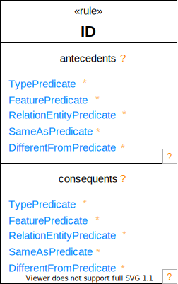

# Graphical Syntax # {#GraphicalSyntax}

## Graphical Conventions ## {#Graphical-Conventions}

**BNF Notation**

The textual symbols are colored in orange, whereas the symbols colored in gray are BNF markings. They will not show up in actual rendering of OML diagrams.

**Hyperlink**

Elements with a blue hyperlink can be clicked on to redirect to a detailed description of their abstract syntax.

**Compartment**

Diagram compartments are laid out in free form, and list compartments are laid out vertically.

## Graphical BNF ## {#Graphical-BNF}

<pre class="highlight highlight-html">

<a id="Concept-Diagram">Concept</a>:

    

<a id="Aspect-Diagram">Aspect</a>:

    

<a id="Structure-Diagram">Structure</a>:

    

<a id="FacetedScalar-Diagram">FacetedScalar</a>:

    

<a id="EnumeratedScalar-Diagram">EnumeratedScalar</a>:

    

<a id="Rule-Diagram">Rule</a>:

    

</pre>