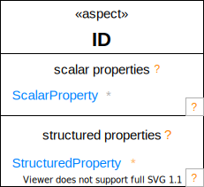
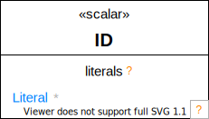
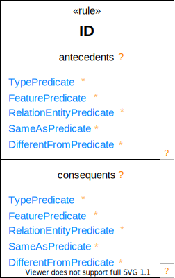

# Graphical BNF # {#Graphical-BNF}

**Convensions**

BNF symbols are colored in orange and will not show up in actual rendering of OML diagrams. Elements with a hyperlink can be clicked on to navigate to a detailed description of their abstract syntax. Shares are laid freely on diagrams. List compartments (within shapes) are always laid out in a vertical stack.

<pre class="highlight highlight-html">

<a id="Concept-Diagram">Concept</a>:

    

<a id="Aspect-Diagram">Aspect</a>:

    

<a id="Scalar-Diagram">Scalar</a>:

    

<a id="Rule-Diagram">Rule</a>:

    

</pre>